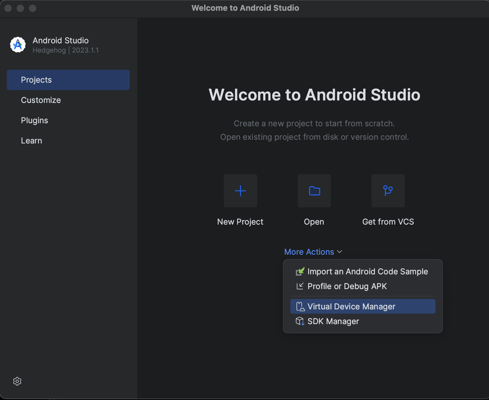

# Playwright Sample Framework to test plex.tv 
# WORK IN PROCESS

## Setup

 - download and install node
 - run the following command

 ```sh
 npm init playwright@latest --yes -- --quiet --browser=chromium --browser=firefox --browser=webkit --gha
 ```

 - create an .env file in the root directory and populuate with your plex user name and password 

## Run tests
 
To run the Android tests you will need to an Android device or AVD Emulator running.  
To run the AVD Emulator download Android Studio, and launch a virtual device from the Virtual
Device Manager.  From the next window select an Android device to launch.



To run the test suite in headless mode, use the following command:


```sh
npm run test 
```

To run the test suite in headed mode, use the following command:

```sh
npm run test:headed
```

To run the test suite in debug mode, use the following command:

```sh
npm run test:debug
```

To run just the Android tests, use the following command:

```sh
npm run test:android
```

To run just the desktop based tests, use the following command:

```sh
npm run test:desktop
```

If you only want to run a single set of tests you can set it as the last parameter.

```sh
npm run test:headed account.spec.ts
```


## Note

 - the test scenario of adding a profile image in the account.spec.ts will fail on first 2 initial runs as the baseline screenshots do not exist.  After the initial runs the image files will exist in `tests/account.spec.ts-snapshots` for all future runs of this particlar test.